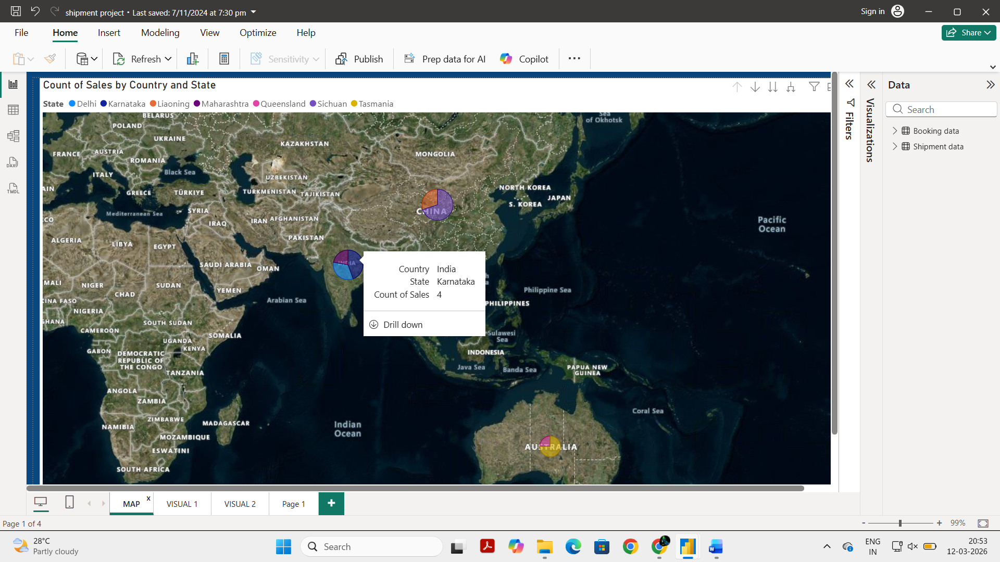
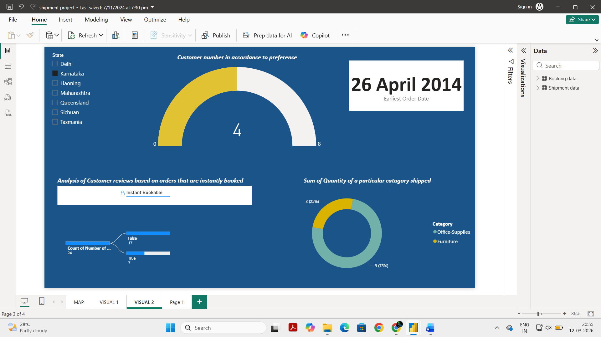
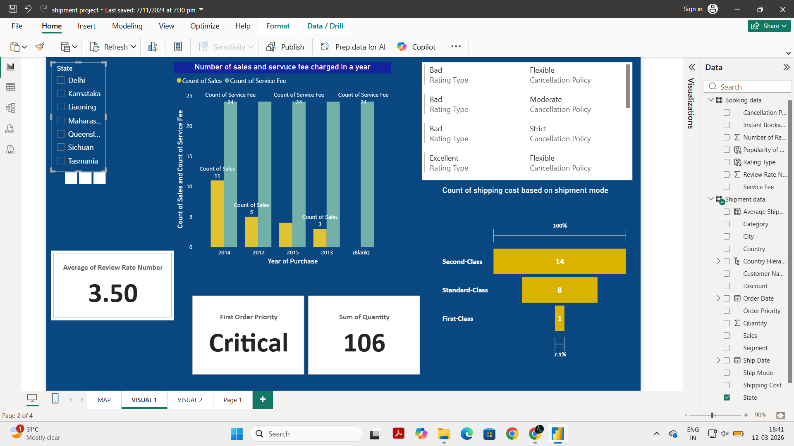

# Supply Chain Analytics Dashboard (Power BI)

## Overview
This project presents an interactive Power BI dashboard designed to analyze shipment operations and customer booking behavior. The dashboard provides insights into shipment distribution, shipping costs, product categories, and customer feedback.

## Tools Used
- Microsoft Power BI
- Power Query
- DAX
- Data Modeling

## Datasets
Two datasets were used in this project:

1. Booking Data
2. Shipment Data

These datasets were integrated in Power BI to analyze logistics performance and customer behavior.
The dataset used for this project is not included in this repository due to availability limitations.
However, the Power BI dashboard file and project report demonstrate the data modeling, DAX calculations, and dashboard development performed during the project.

## Key Insights
- Shipment distribution across different geographic locations
- Shipping cost comparison across shipment modes
- Customer review and rating analysis
- Product category shipment distribution
- Booking behavior analysis

## Project Structure

```
supply-chain-analytics-dashboard/
│
├── README.md
├── Report.pdf
├── supply-chain-analytics-dashboard.pbix
└── dashboard_images.png
```

## Dashboard Preview
### Shipment Distribution Map
<p align="center">
  
</p>

### Customer Preference Analysis
<p align="center">
  
</p>

### Shipping Cost Analysis
<p align="center">
  
</p>


## Contributors
- mahema-14 (Repository Owner)
- Namitha906 (Project Collaborator)

Project developed as part of the Power BI Essentials – Data to Dashboard Certification Program.
